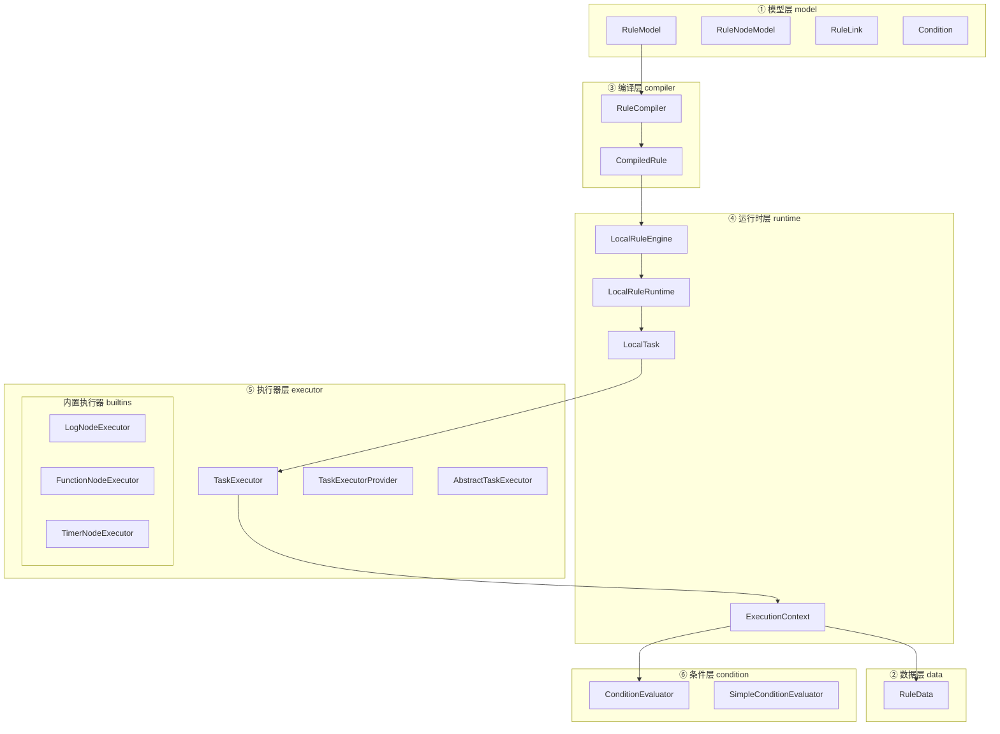
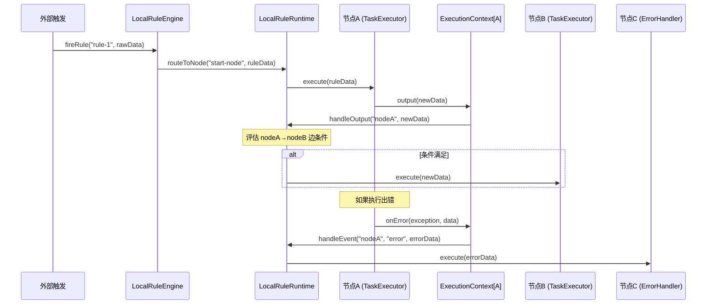

# 规则引擎学习版 — 实现计划

> 本文档基于 [JETLINKS_RULE_ENGINE_ANALYSIS.md](./JETLINKS_RULE_ENGINE_ANALYSIS.md) 和 [SIMPLIFIED_DESIGN.md](./SIMPLIFIED_DESIGN.md) 的分析结论，将设计方向细化为可执行的实现清单。

---

## 0. 核心思想回顾

在动手之前，先明确我们要实现的本质：

**"把一个规则图编译成一组节点任务，再通过统一上下文和统一数据信封，让数据和事件在节点之间流动。"**

整条链路可以浓缩为：

```
RuleModel（规则图） → RuleCompiler（编译） → LocalRuleRuntime（运行时） → 数据在节点间流转
```

---

## 1. 实现分层总览



---

## 2. Phase 1：模型层（model）

### 2.1 目标

定义规则图的静态结构。这一层纯粹是数据对象，不含任何执行逻辑。

### 2.2 要实现的类

#### `RuleModel` — 规则图

```java
public class RuleModel {
    private String id;              // 规则 ID
    private String name;            // 规则名称
    private Map<String, Object> configuration; // 规则级别配置
    private List<RuleNodeModel> nodes;         // 所有节点
    private List<RuleLink> links;              // 所有连线
}
```

**设计要点**：
- JetLinks 原版的 `RuleModel` 也是一个扁平的节点 + 连线列表
- 我们保留 `configuration` 用于规则级配置（比如全局变量），但第一版可以不用

#### `RuleNodeModel` — 节点

```java
public class RuleNodeModel {
    private String id;              // 节点唯一 ID
    private String name;            // 节点显示名
    private String executor;        // 执行器标识（对应 TaskExecutorProvider 的 key）
    private Map<String, Object> configuration; // 节点配置（传给执行器）
    private List<RuleLink> outputs;            // 普通输出边
    private List<RuleLink> events;             // 事件输出边
}
```

**设计要点**：
- `executor` 字段是核心：它决定了运行时用哪个执行器来处理这个节点
- JetLinks 中这个字段就是 `RuleNodeModel.getExecutor()`
- `outputs` 是普通数据边（节点产出数据后走这些边）
- `events` 是事件边（节点触发 complete / error / 自定义事件后走这些边）

#### `RuleLink` — 连线

```java
public class RuleLink {
    private String id;              // 连线 ID
    private String type;            // 连线类型："output" 或事件名如 "complete"、"error"
    private RuleNodeModel source;   // 源节点引用
    private RuleNodeModel target;   // 目标节点引用
    private Condition condition;    // 可选条件
}
```

**设计要点**：
- JetLinks 的 `RuleLink` 也有 `condition` 字段
- `type` 字段用于区分普通边和事件边（JetLinks 里是通过放在不同列表来区分的，我们也可以两种方式兼用）

#### `Condition` — 条件

```java
public class Condition {
    private String type;            // 条件类型标识
    private Map<String, Object> configuration; // 条件配置
}
```

**设计要点**：
- JetLinks 的 `Condition` 也是 `type + configuration` 的组合
- `type` 对应 `ConditionEvaluator` 的查找 key
- 第一版支持的 type：`always_true`、`header_equals`、`field_equals`

### 2.3 原理说明：为什么用图而不是 if-else

传统规则引擎（Drools）的思路是"事实 + 规则 + 推理"，适合大量业务规则的匹配。JetLinks 的思路完全不同：

- 它把规则建模为**有向图**（类似有限状态机 + 数据流）
- 每个节点是一种**处理能力**
- 每条边是**数据流向**，可以带条件
- 这种设计天然适合 IoT 场景：数据进来 → 转换 → 判断 → 动作

用图的好处：
1. **可视化友好**：拖线连节点，所见即所得
2. **可组合**：节点可以任意连接，组合出复杂流程
3. **可扩展**：新增一种节点不影响引擎主体

---

## 3. Phase 2：数据层（data）

### 3.1 目标

定义流转在节点之间的统一数据信封。

### 3.2 要实现的类

#### `RuleData` — 数据信封

```java
public class RuleData {
    private String id;              // 数据 ID（每条数据唯一）
    private String contextId;       // 同一次规则执行的上下文 ID
    private Object data;            // 实际业务数据
    private Map<String, Object> headers; // 元信息 headers
    private String sourceNodeId;    // 这条数据来自哪个节点

    // 工厂方法
    public static RuleData create(Object data) { ... }
    public static RuleData create(Object data, String sourceNodeId) { ... }
}
```

**设计要点**：
- JetLinks 的 `RuleData` 有 `id` / `contextId` / `data` / `headers`
- 我们额外加 `sourceNodeId`，方便调试时追溯数据来源
- `contextId` 用于标识同一次规则执行流程中的所有数据，第一版可以用 UUID
- `headers` 可以存放标记信息（如 `_end: true` 表示终止）

### 3.3 原理说明：为什么需要统一信封

如果每个节点直接传递业务对象，会出现以下问题：

1. **元信息丢失**：无法追踪数据来源、执行链路
2. **类型不统一**：上游节点输出 Map，下游期望 POJO，没有统一容器做适配
3. **条件判断困难**：条件需要读 headers 做路由，没有信封就无处挂 headers

所以"统一信封"是数据流框架的标准做法（类似 HTTP 的 Request/Response、消息队列的 Message）。

---

## 4. Phase 3：条件层（condition）

### 4.1 目标

实现边上的条件判断能力。

### 4.2 要实现的类

#### `ConditionEvaluator` — 条件判断器接口

```java
public interface ConditionEvaluator {
    /**
     * 判断条件是否满足
     */
    boolean evaluate(Condition condition, RuleData data);

    /**
     * 支持的条件类型
     */
    String getType();
}
```

#### `SimpleConditionEvaluator` — 简单条件判断器

实现以下判断逻辑：

| type | 说明 | configuration 示例 |
|------|------|-------------------|
| `always_true` | 无条件通过 | `{}` |
| `header_equals` | 判断 RuleData header 的某字段等于某值 | `{"key": "type", "value": "alarm"}` |
| `field_equals` | 判断 RuleData data 的某字段等于某值 | `{"key": "temperature", "value": 30}` |
| `expression` | 支持简单表达式（可选，第一版可不做） | `{"expr": "data.value > 50"}` |

#### `ConditionEvaluatorRegistry` — 条件判断器注册表

```java
public class ConditionEvaluatorRegistry {
    private Map<String, ConditionEvaluator> evaluators = new HashMap<>();

    public void register(ConditionEvaluator evaluator);
    public boolean evaluate(Condition condition, RuleData data);
}
```

### 4.3 原理说明：条件为什么放在边上

JetLinks 的一个关键设计决策是：条件判断在**边**上，不在**节点**内。

这意味着：
- 节点只管"做事"（处理数据）
- 边负责"路由"（决定数据去哪）
- 同一个节点可以有多条输出边，每条边带不同条件 → 自然实现分支逻辑

这比在节点内写 if-else 更灵活：修改路由逻辑不需要改节点代码，只需要改边的条件配置。

---

## 5. Phase 4：执行器层（executor）

### 5.1 目标

定义节点执行能力的接口和注册机制，并实现若干内置执行器。

### 5.2 要实现的接口

#### `TaskExecutor` — 节点执行器

```java
public interface TaskExecutor {
    /**
     * 执行器名称（对应 RuleNodeModel.executor）
     */
    String getName();

    /**
     * 初始化（规则启动时调用）
     */
    void start(ExecutionContext context);

    /**
     * 处理输入数据
     */
    void execute(RuleData input, ExecutionContext context);

    /**
     * 停止（规则关闭时调用）
     */
    void stop();
}
```

#### `TaskExecutorProvider` — 执行器工厂

```java
public interface TaskExecutorProvider {
    /**
     * 该工厂支持的执行器标识
     */
    String getExecutor();

    /**
     * 根据节点配置创建执行器实例
     */
    TaskExecutor createExecutor(Map<String, Object> configuration);
}
```

#### `AbstractTaskExecutor` — 执行器基类

提供通用实现：

```java
public abstract class AbstractTaskExecutor implements TaskExecutor {
    protected ExecutionContext context;

    @Override
    public void start(ExecutionContext context) {
        this.context = context;
    }

    @Override
    public void stop() { }

    /**
     * 子类实现具体处理逻辑
     */
    protected abstract void doExecute(RuleData input);

    @Override
    public void execute(RuleData input, ExecutionContext context) {
        try {
            doExecute(input);
        } catch (Exception e) {
            context.onError(e, input);
        }
    }
}
```

### 5.3 内置执行器（builtins）

第一版至少实现以下 4 种：

| 执行器 | executor 标识 | 功能 | 配置项 |
|--------|--------------|------|--------|
| `LogNodeExecutor` | `log` | 打印收到的数据（调试用） | `level`(optional) |
| `FunctionNodeExecutor` | `function` | 对数据做简单变换（Map 操作） | `script`(field mappings) |
| `FilterNodeExecutor` | `filter` | 根据条件过滤数据，满足才往下游发 | `condition`(内嵌 Condition) |
| `DelayNodeExecutor` | `delay` | 延迟后继续传递（演示异步概念） | `delayMs` |

扩展版（第二期可做）：

| 执行器 | executor 标识 | 功能 |
|--------|--------------|------|
| `TimerNodeExecutor` | `timer` | 定时触发数据源 |
| `ScriptNodeExecutor` | `script` | Nashorn/GraalVM 脚本执行 |
| `AggregateNodeExecutor` | `aggregate` | 窗口聚合 |

### 5.4 原理说明：执行器 + Provider 模式

JetLinks 最体现功力的一点就是把**引擎骨架**和**节点能力**彻底拆开：

```
引擎不知道"设备告警节点"怎么实现
引擎也不知道"SQL 节点"怎么处理数据
引擎只知道：每个节点会由一个 TaskExecutor 执行
```

`TaskExecutorProvider` 的作用就是"根据节点配置中的 executor 字段，找到正确的工厂，创建出正确的执行器"。

这是标准的**策略模式 + 工厂模式**组合：
- 策略模式：不同执行器是不同策略
- 工厂模式：Provider 负责创建策略实例
- 注册表模式：引擎维护一个 `Map<String, TaskExecutorProvider>` 来查找

---

## 6. Phase 5：编译层（compiler）

### 6.1 目标

将设计时的 `RuleModel` 编译成运行时可直接使用的 `CompiledRule`。

### 6.2 要实现的类

#### `CompiledRule` — 编译结果

```java
public class CompiledRule {
    private String ruleId;
    private Map<String, RuleNodeModel> nodeMap;            // nodeId → 节点定义
    private Map<String, List<OutputLink>> outputLinks;     // nodeId → 普通输出边
    private Map<String, Map<String, List<OutputLink>>> eventLinks; // nodeId → (event → 事件输出边)
    private List<String> startNodeIds;                     // 起始节点 ID 列表
}
```

#### `OutputLink` — 编译后的输出边

```java
public class OutputLink {
    private String targetNodeId;    // 目标节点 ID
    private Condition condition;    // 条件（可为 null，表示无条件通过）
}
```

#### `RuleCompiler` — 编译器

```java
public class RuleCompiler {
    /**
     * 将 RuleModel 编译为 CompiledRule
     */
    public CompiledRule compile(RuleModel model) {
        // 1. 构建 nodeId → node 映射
        // 2. 解析普通输出边，按 source node 分组
        // 3. 解析事件输出边，按 source node + event type 分组
        // 4. 识别起始节点（无入边的节点 或 标记为 start 的节点）
        // 5. 校验图的合法性（孤立节点、循环检测等）
        return compiledRule;
    }
}
```

### 6.3 原理说明：为什么要"编译"

JetLinks 的 `ScheduleJobCompiler` 做的就是这件事。编译阶段的好处：

1. **把"模型"和"执行"隔开**：模型不含执行逻辑，编译结果不含模型冗余数据
2. **预处理路由表**：运行时不需要每次都遍历 links 查找下游节点
3. **校验前置**：在编译阶段就发现图的问题（孤立节点、缺失执行器等），而不是运行时才报错
4. **一次编译多次执行**：同一个规则可以创建多个运行时实例

---

## 7. Phase 6：运行时层（runtime）

### 7.1 目标

让编译后的规则真正跑起来：创建执行器实例、管理任务生命周期、驱动数据在节点间流转。

### 7.2 要实现的类

#### `LocalRuleEngine` — 规则引擎入口

```java
public class LocalRuleEngine {
    private RuleCompiler compiler;
    private Map<String, TaskExecutorProvider> providers;   // executor → provider
    private ConditionEvaluatorRegistry conditionRegistry;
    private Map<String, LocalRuleRuntime> runtimes;        // ruleId → 运行时实例

    /**
     * 启动一个规则
     */
    public LocalRuleRuntime startRule(RuleModel model) {
        CompiledRule compiled = compiler.compile(model);
        LocalRuleRuntime runtime = new LocalRuleRuntime(compiled, providers, conditionRegistry);
        runtime.start();
        runtimes.put(model.getId(), runtime);
        return runtime;
    }

    /**
     * 停止一个规则
     */
    public void stopRule(String ruleId) { ... }

    /**
     * 向规则的起始节点注入数据
     */
    public void fireRule(String ruleId, Object data) { ... }
}
```

#### `LocalRuleRuntime` — 单个规则的运行时实例

```java
public class LocalRuleRuntime {
    private CompiledRule compiledRule;
    private Map<String, LocalTask> tasks;  // nodeId → task 实例
    private ConditionEvaluatorRegistry conditionRegistry;

    /**
     * 启动所有节点任务
     */
    public void start() {
        for (RuleNodeModel node : compiledRule.getNodeMap().values()) {
            TaskExecutor executor = createExecutor(node);
            ExecutionContext context = createContext(node);
            LocalTask task = new LocalTask(node.getId(), executor, context);
            tasks.put(node.getId(), task);
            task.start();
        }
    }

    /**
     * 路由数据到指定节点
     */
    public void routeToNode(String nodeId, RuleData data) {
        LocalTask task = tasks.get(nodeId);
        task.execute(data);
    }

    /**
     * 处理节点普通输出：评估条件并路由
     */
    public void handleOutput(String sourceNodeId, RuleData data) {
        List<OutputLink> outputs = compiledRule.getOutputLinks().get(sourceNodeId);
        if (outputs == null) return;
        for (OutputLink link : outputs) {
            if (link.getCondition() == null || conditionRegistry.evaluate(link.getCondition(), data)) {
                routeToNode(link.getTargetNodeId(), data);
            }
        }
    }

    /**
     * 处理节点事件输出
     */
    public void handleEvent(String sourceNodeId, String event, RuleData data) {
        Map<String, List<OutputLink>> eventMap = compiledRule.getEventLinks().get(sourceNodeId);
        if (eventMap == null) return;
        List<OutputLink> links = eventMap.get(event);
        if (links == null) return;
        for (OutputLink link : links) {
            if (link.getCondition() == null || conditionRegistry.evaluate(link.getCondition(), data)) {
                routeToNode(link.getTargetNodeId(), data);
            }
        }
    }
}
```

#### `LocalTask` — 运行中的节点任务

```java
public class LocalTask {
    private String nodeId;
    private TaskExecutor executor;
    private ExecutionContext context;
    private TaskState state; // WAITING, RUNNING, PAUSED, STOPPED

    public void start() { executor.start(context); state = RUNNING; }
    public void execute(RuleData data) { executor.execute(data, context); }
    public void stop() { executor.stop(); state = STOPPED; }
}
```

#### `ExecutionContext` — 执行上下文

```java
public class ExecutionContext {
    private String nodeId;
    private LocalRuleRuntime runtime;
    private Map<String, Object> nodeConfig;

    /** 创建新的 RuleData */
    public RuleData newRuleData(Object data) { ... }

    /** 向下游输出数据（走普通边） */
    public void output(RuleData data) {
        runtime.handleOutput(nodeId, data);
    }

    /** 触发事件（走事件边） */
    public void fireEvent(String event, RuleData data) {
        runtime.handleEvent(nodeId, event, data);
    }

    /** 触发错误事件 */
    public void onError(Throwable error, RuleData data) {
        data.getHeaders().put("_error", error.getMessage());
        fireEvent("error", data);
    }

    /** 获取节点配置 */
    public Map<String, Object> getNodeConfig() { return nodeConfig; }
}
```

### 7.3 原理说明：数据流转机制

整个数据流转可以用一张图概括：



关键要理解的是：
1. **节点不直接调用下游节点**，而是通过 `ExecutionContext.output()` 写出数据
2. **运行时根据编译后的路由表**决定数据去哪
3. **条件判断发生在路由时**，不在节点内
4. **错误也是一种事件**，通过事件边流向错误处理节点

---

## 8. 实现顺序与依赖关系

```mermaid
gantt
    title 实现阶段与依赖
    dateFormat X
    axisFormat %s

    section Phase 1 模型层
    RuleModel/RuleNodeModel/RuleLink/Condition  :p1, 0, 1

    section Phase 2 数据层
    RuleData                                     :p2, 0, 1

    section Phase 3 条件层
    ConditionEvaluator/Registry                  :p3, after p2, 1

    section Phase 4 执行器层
    TaskExecutor/Provider 接口                   :p4a, after p2, 1
    AbstractTaskExecutor                         :p4b, after p4a, 1
    内置执行器 (log/function/filter)              :p4c, after p4b, 1

    section Phase 5 编译层
    RuleCompiler/CompiledRule                    :p5, after p1, 1

    section Phase 6 运行时层
    ExecutionContext                             :p6a, after p3 p4a, 1
    LocalTask                                   :p6b, after p6a, 1
    LocalRuleRuntime                            :p6c, after p5 p6b, 1
    LocalRuleEngine                             :p6d, after p6c p4c, 1

    section Phase 7 测试
    单元测试                                     :p7a, after p6d, 1
    集成场景测试                                  :p7b, after p7a, 1
```



Phase 1-2 可以并行，Phase 3-4 可以部分并行，Phase 5-6 是主链路。

---

## 9. Phase 7：测试与验证

### 9.1 单元测试

| 测试类 | 覆盖范围 |
|--------|---------|
| `RuleModelTest` | 模型构建、节点查找 |
| `RuleDataTest` | 数据信封创建、headers 读写 |
| `ConditionEvaluatorTest` | 各类型条件判断 |
| `RuleCompilerTest` | 编译正确性、起始节点识别、异常检测 |
| `TaskExecutorTest` | 各内置执行器的单独测试 |

### 9.2 集成场景测试

设计 3 个端到端场景：

#### 场景 1：线性链式执行

```
[Start] → [Function: 提取温度] → [Log: 打印结果]
```

验证：数据从头流到尾，Function 正确变换，Log 正确输出。

#### 场景 2：分支条件判断

```
[Start] → [条件: temperature > 30] → [Log: "高温告警"]
       → [条件: temperature <= 30] → [Log: "温度正常"]
```

验证：不同数据走不同分支。

#### 场景 3：事件边 + 错误处理

```
[Start] → [Function: 可能抛异常]
               ├── output → [Log: "成功处理"]
               └── error  → [Log: "错误处理"]
```

验证：正常数据走 output 边，异常数据走 error 边。

### 9.3 可运行示例

提供一个 `RuleEngineDemo.java`（带 `main` 方法），用 Java 代码构建上面的场景 2 并运行：

```java
public class RuleEngineDemo {
    public static void main(String[] args) {
        // 1. 构建规则图
        RuleModel model = new RuleModel();
        // ... 添加节点和边 ...

        // 2. 启动规则
        LocalRuleEngine engine = new LocalRuleEngine();
        engine.startRule(model);

        // 3. 注入数据
        engine.fireRule("rule-1", Map.of("temperature", 35));   // → 走高温分支
        engine.fireRule("rule-1", Map.of("temperature", 20));   // → 走正常分支
    }
}
```

---

## 10. 项目结构

```text
rule-engine/
├── README.md
├── JETLINKS_RULE_ENGINE_ANALYSIS.md
├── SIMPLIFIED_DESIGN.md
├── IMPLEMENTATION_PLAN.md              ← 本文档
├── pom.xml
└── src/
    ├── main/java/com/example/ruleengine/
    │   ├── model/
    │   │   ├── RuleModel.java
    │   │   ├── RuleNodeModel.java
    │   │   ├── RuleLink.java
    │   │   └── Condition.java
    │   ├── data/
    │   │   └── RuleData.java
    │   ├── compiler/
    │   │   ├── RuleCompiler.java
    │   │   ├── CompiledRule.java
    │   │   └── OutputLink.java
    │   ├── runtime/
    │   │   ├── LocalRuleEngine.java
    │   │   ├── LocalRuleRuntime.java
    │   │   ├── LocalTask.java
    │   │   ├── TaskState.java
    │   │   └── ExecutionContext.java
    │   ├── executor/
    │   │   ├── TaskExecutor.java
    │   │   ├── TaskExecutorProvider.java
    │   │   ├── AbstractTaskExecutor.java
    │   │   └── builtins/
    │   │       ├── LogNodeExecutor.java
    │   │       ├── FunctionNodeExecutor.java
    │   │       ├── FilterNodeExecutor.java
    │   │       └── DelayNodeExecutor.java
    │   └── condition/
    │       ├── ConditionEvaluator.java
    │       ├── ConditionEvaluatorRegistry.java
    │       └── SimpleConditionEvaluator.java
    └── test/java/com/example/ruleengine/
        ├── model/RuleModelTest.java
        ├── data/RuleDataTest.java
        ├── compiler/RuleCompilerTest.java
        ├── condition/ConditionEvaluatorTest.java
        ├── executor/TaskExecutorTest.java
        ├── integration/
        │   ├── LinearChainTest.java
        │   ├── BranchConditionTest.java
        │   └── EventErrorHandlingTest.java
        └── demo/RuleEngineDemo.java
```

---

## 11. 技术栈

| 技术 | 版本 | 用途 |
|:---|:---|:---|
| Java | 17+ | 主语言 |
| Maven | 3.8+ | 构建 |
| Jackson | 2.15+ | JSON（RuleData 中 data 的序列化） |
| JUnit 5 | 5.10+ | 测试 |
| SLF4J + Logback | 最新稳定版 | 日志 |
| Lombok | 最新稳定版 | 减少样板 |

> 与 eventbus 模块保持一致的技术选型，便于后期集成。

---

## 12. 与 EventBus 模块的关系

当前学习版**刻意不依赖 EventBus**。节点间通信通过直接方法调用实现（`runtime.routeToNode()`）。

但架构预留了集成点：

| 当前实现 | 未来可替换为 |
|:--------|:-----------|
| `ExecutionContext.output()` → 直接调用 `runtime.handleOutput()` | 通过 EventBus 发布到 output topic |
| `ExecutionContext.fireEvent()` → 直接调用 `runtime.handleEvent()` | 通过 EventBus 发布到 event topic |

JetLinks 正是走的后一条路（`EventBusOutput` / `EventBusInput`），而我们学习版先用简单版本把概念理清。

---

## 13. 后续扩展路线（第二期）

完成第一版后，可以按以下优先级逐步增加：

1. **异步执行**：引入 `ExecutorService`，让节点执行和数据路由异步化
2. **Timer 源节点**：用 `ScheduledExecutorService` 实现定时触发
3. **脚本节点**：集成 Nashorn/GraalVM，支持 JavaScript 脚本
4. **EventBus 集成**：把直接方法调用替换为 EventBus topic 路由
5. **规则 Builder**：提供 fluent API 更优雅地构建规则图
6. **UI 模型解析**：支持从 JSON 格式解析规则图（对接前端设计器）
7. **Scope 状态**：按 JetLinks 的 global / flow / node 三级 scope 设计状态管理

---

## 14. 学习收获总览

完成本项目后，应能清晰回答以下问题：

| # | 问题 | 对应实现 |
|---|------|---------|
| 1 | 什么是"规则图" | `RuleModel` / `RuleNodeModel` / `RuleLink` |
| 2 | 图和 if-else 的区别是什么 | 模型层设计 + 条件在边上的架构 |
| 3 | 为什么要编译 | `RuleCompiler` 的路由表预处理 |
| 4 | 节点执行器怎么做到可插拔 | `TaskExecutor` + `TaskExecutorProvider` |
| 5 | 数据信封是什么意思 | `RuleData` 的设计 |
| 6 | 条件判断为什么放在边上 | `ConditionEvaluator` + 路由时调用 |
| 7 | 普通边和事件边有什么区别 | output vs event 两套路由表 |
| 8 | 运行时上下文的职责是什么 | `ExecutionContext` 提供的 API |
| 9 | 错误如何传播 | `onError()` → `fireEvent("error", ...)` |
| 10 | 怎么从本地版扩展到分布式 | EventBus 集成路线 |
